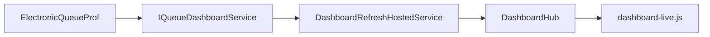

# Live-мониторинг Dashboard: краткий обзор

**Полная спецификация для разработки** (SignalR, БД, сервер, клиент, приёмка): **[dashboard-signalr-live-spec.md](dashboard-signalr-live-spec.md)**.

Документ ниже — сжатое резюме. При противоречии с полной spec — см. [dashboard-signalr-live-spec.md](dashboard-signalr-live-spec.md) (после внедрения приоритет у кода).

**Связанные документы:** UI — [queue-monitoring-page-ui-requirements.md](queue-monitoring-page-ui-requirements.md); БД — [electronic-queue-prof-schema.md](electronic-queue-prof-schema.md).

---

## Область

| В scope | Вне scope |
|---------|-----------|
| `/dashboard`, snapshot `DashboardViewModel`, SignalR | Отчёты, новые метрики/колонки, запись в БД |
| `IQueueDashboardService` (live/mock) | SqlDependency, CDC, push из внешней очереди |
| Права `dashboard.*` | Клиентский polling как целевая архитектура |

**Baseline:** SignalR и фоновый refresh в коде **ещё не реализованы** — см. § «Baseline» в [dashboard-signalr-live-spec.md](dashboard-signalr-live-spec.md).

---

## Архитектура (резюме)

1. Один фоновый опрос БД на инстанс — не polling с каждой вкладки.  
2. Данные только через `GetDashboardAsync()` (live или mock).  
3. Hub `/hubs/dashboard`, событие `DashboardUpdated`, JWT из cookie.  
4. В push **нет** `Ui` — видимость блоков задаётся при SSR.

---

## Контракт snapshot (кратко)

Метрики: `WaitingCount`, `InServiceCount`, `AcceptedTodayCount`, `NoShowTodayCount`, средние/макс. ожидание и приём.  
Списки: `ActiveQueue`, `DoctorLoadCards`.  
Детальные поля JSON — [dashboard-signalr-live-spec.md §5](dashboard-signalr-live-spec.md#5-контракт-данных).

Расчёт live — [QueueDashboardService.cs](../../../Services/Dashboard/QueueDashboardService.cs); таблицы БД — [electronic-queue-prof-schema.md](electronic-queue-prof-schema.md).

---

## Критерии готовности

Полный чеклист — [dashboard-signalr-live-spec.md §9](dashboard-signalr-live-spec.md#9-критерии-приёмки).

- [ ] `/dashboard` без F5  
- [ ] Live snapshot согласован с `GetDashboardAsync()`  
- [ ] Mock при недоступной БД, Hub не падает  
- [ ] Блоки без `dashboard.*` не обновляются  
- [ ] Фильтры таблицы очереди после push  

---

## Код (точки входа)

| Файл | Назначение |
|------|------------|
| [DashboardController.cs](../../../Controllers/Dashboard/DashboardController.cs) | SSR |
| [ResilientQueueDashboardService.cs](../../../Services/Dashboard/ResilientQueueDashboardService.cs) | Live/mock |
| [Program.cs](../../../Program.cs) | Auth; SignalR — по [spec](dashboard-signalr-live-spec.md) |
