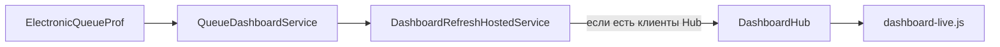

# Live-мониторинг Dashboard: краткий обзор

**Полная спецификация для разработки** (SignalR, БД, сервер, клиент, приёмка): **[dashboard-signalr-live-spec.md](dashboard-signalr-live-spec.md)**.

Документ ниже — сжатое резюме. При противоречии с полной spec — см. [dashboard-signalr-live-spec.md](dashboard-signalr-live-spec.md) (после внедрения приоритет у кода).

**Связанные документы:** UI — [queue-monitoring-page-ui-requirements.md](queue-monitoring-page-ui-requirements.md); БД — [electronic-queue-prof-schema.md](electronic-queue-prof-schema.md).

---

## Область

| В scope | Вне scope |
|---------|-----------|
| `/dashboard`, snapshot `DashboardViewModel`, SignalR | Отчёты, новые метрики/колонки, запись в БД |
| `IQueueDashboardService` → только live (`QueueDashboardService`) | Mock/demo-данные, SqlDependency, CDC |
| Права `dashboard.*` | Клиентский polling как целевая архитектура |

**Baseline:** SignalR, фоновый refresh, опрос БД только при подключённых клиентах Hub, Toast при ошибках связи.

---

## Архитектура (резюме)

1. Один фоновый опрос БД на инстанс — **только если** есть подключения к `/hubs/dashboard`.  
2. Данные только через `GetDashboardAsync()` из live БД; талоны и метрики — **за сегодня (МСК**, `QueueDashboardClock` / `MonitoringOptions.QueueTimeZoneId`).  
3. Hub `/hubs/dashboard`, событие `DashboardUpdated`, JWT из cookie.  
4. В push **нет** `Ui` — видимость блоков задаётся при SSR.  
5. Ошибки SignalR — Toast (`global-toast-stack`), без индикатора связи.

---

## Контракт snapshot (кратко)

Метрики: `WaitingCount`, `InServiceCount`, `AcceptedTodayCount`, средние/макс. ожидание и приём.  
Списки: `ActiveQueue`, `DoctorLoadCards`.  
Детальные поля JSON — [dashboard-signalr-live-spec.md §5](dashboard-signalr-live-spec.md#5-контракт-данных).

Расчёт live — [QueueDashboardService.cs](../../../Services/Dashboard/QueueDashboardService.cs); таблицы БД — [electronic-queue-prof-schema.md](electronic-queue-prof-schema.md).

---

## Критерии готовности

Полный чеклист — [dashboard-signalr-live-spec.md §9](dashboard-signalr-live-spec.md#9-критерии-приёмки).

- [x] `/dashboard` без F5  
- [x] Live snapshot согласован с `GetDashboardAsync()`  
- [x] При недоступной EQ — предупреждение, без mock и без push  
- [x] Блоки без `dashboard.*` не обновляются  
- [x] Фильтры таблицы очереди после push  
- [x] Неавторизованный доступ к MVC — redirect на `/Account/Login`

---

## Код (точки входа)

| Файл | Назначение |
|------|------------|
| [DashboardController.cs](../../../Controllers/Dashboard/DashboardController.cs) | SSR |
| [QueueDashboardService.cs](../../../Services/Dashboard/QueueDashboardService.cs) | Live-расчёт |
| [DashboardRefreshHostedService.cs](../../../Services/Dashboard/DashboardRefreshHostedService.cs) | Push по таймеру |
| [DashboardHubConnectionTracker.cs](../../../Services/Dashboard/DashboardHubConnectionTracker.cs) | Счётчик клиентов Hub |
| [dashboard-live.js](../../../wwwroot/js/dashboard-live.js) | SignalR + DOM + Toast |
| [Index.cshtml](../../../Views/Dashboard/Index.cshtml) | CDN `@microsoft/signalr` 8.0.7 (секция Scripts) |
| [Program.cs](../../../Program.cs) | Auth; SignalR |

