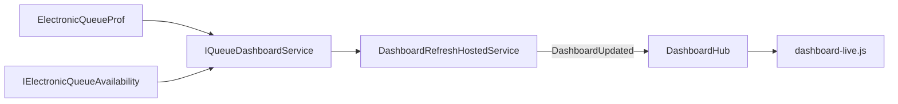
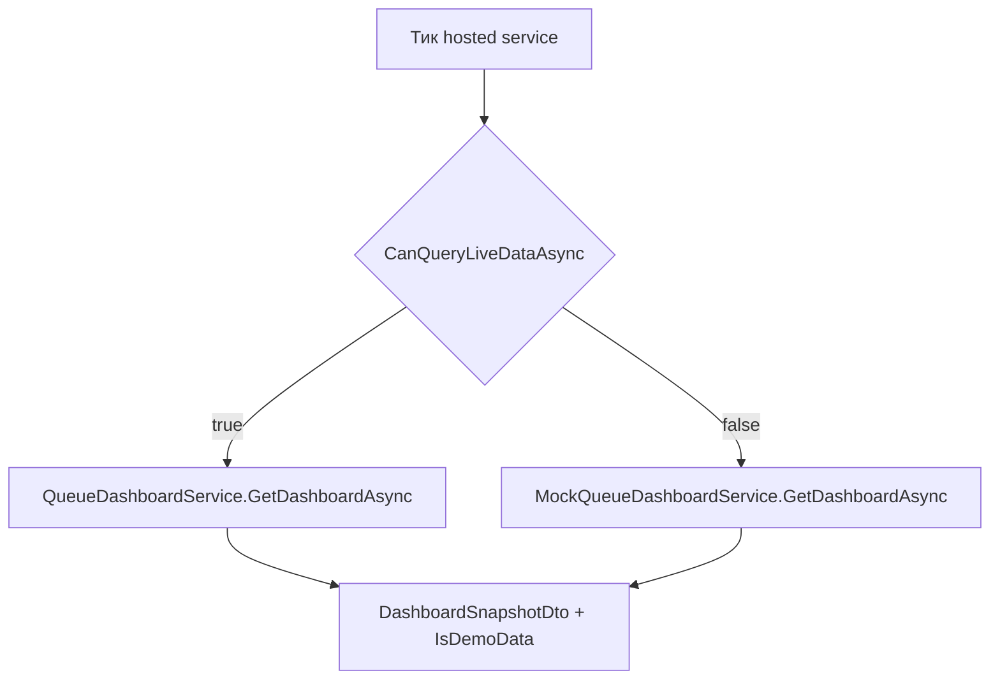

# Спецификация: SignalR live-мониторинг очереди (`/dashboard`)

Документ — **единый источник для разработки** транспорта live-обновления страницы «Мониторинг».  
Краткий обзор — [dashboard-live-monitoring-minimum.md](dashboard-live-monitoring-minimum.md).  
UI страницы — [queue-monitoring-page-ui-requirements.md](queue-monitoring-page-ui-requirements.md).  
Схема и таблицы БД — [electronic-queue-prof-schema.md](electronic-queue-prof-schema.md).

---

## Baseline (состояние кода на момент спецификации)

| Компонент | Статус |
|-----------|--------|
| SSR `/dashboard`, `IQueueDashboardService`, live/mock через `ResilientQueueDashboardService` | Реализовано |
| JWT из cookie (`AuthServiceCollectionExtensions`) | Реализовано |
| `ElectronicQueueDbContext`, read-only к `ElectronicQueueProf` | Реализовано |
| SignalR, `DashboardHub`, `DashboardRefreshHostedService`, `dashboard-live.js` | Реализовано |
| `MonitoringOptions.DashboardRefreshSeconds` | Реализовано |

При расхождении spec и кода после внедрения — **приоритет у кода**; spec обновляется отдельно.

---

## 1. Назначение и границы

### 1.1. В scope

| Элемент | Описание |
|---------|----------|
| Страница | `/dashboard` — [Controllers/Dashboard/DashboardController.cs](../../../Controllers/Dashboard/DashboardController.cs) |
| Данные | Один snapshot — [Models/ViewModels/Dashboard/DashboardViewModel.cs](../../../Models/ViewModels/Dashboard/DashboardViewModel.cs); **без новых бизнес-полей** относительно текущего mock/live |
| Источник | [Services/Dashboard/IQueueDashboardService.cs](../../../Services/Dashboard/IQueueDashboardService.cs) → [QueueDashboardService.cs](../../../Services/Dashboard/QueueDashboardService.cs) или [MockQueueDashboardService.cs](../../../Services/Demo/MockQueueDashboardService.cs) через [ResilientQueueDashboardService.cs](../../../Services/Resilience/ResilientQueueDashboardService.cs) (Development) |
| Доставка | ASP.NET Core **SignalR**: серверный периодический сбор snapshot → broadcast подключённым клиентам |
| Права | Существующие `dashboard.*` — [Services/Users/RolePermissionService.cs](../../../Services/Users/RolePermissionService.cs), [DashboardUiVisibility.cs](../../../Models/ViewModels/Dashboard/DashboardUiVisibility.cs) |
| Пользователи | Несколько одновременных диспетчеров/менеджеров на **одном инстансе** приложения — один опрос БД на тик, общая рассылка |

### 1.2. Вне scope

- Отчёты, новые метрики, новые колонки, графики «загруженность за сегодня» на live-странице.
- Запись в `ElectronicQueueProf` (режим read-only сохраняется).
- SqlDependency, CDC, push из внешней системы очереди.
- Клиентский polling (`setInterval` + REST) как **целевая** архитектура (допустим только как временный обход до SignalR).
- Redis / Azure SignalR **backplane** для нескольких реплик приложения — **post-MVP** (см. §10).

---

## 2. Архитектура



### 2.1. Обязательные правила

1. **Один** периодический сбор snapshot на инстанс приложения (`BackgroundService`), не опрос БД с каждого браузера.
2. Рассылка только **авторизованным** клиентам Hub (`[Authorize]`, JWT из cookie).
3. Сбор данных — **только** через `IQueueDashboardService.GetDashboardAsync()` (тот же live/mock, что при первом GET страницы).
4. SSR первого захода — без изменений: [DashboardController](../../../Controllers/Dashboard/DashboardController.cs) заполняет `model.Ui` по правам.
5. Push **не содержит** `Ui` — клиент обновляет только блоки, уже отрисованные при SSR.

### 2.2. Анти-паттерн

`N` открытых вкладок → `N` независимых `setInterval` → `N` запросов к `ElectronicQueueProf` на каждый тик.

### 2.3. Известное расхождение код ↔ UI-spec

В [Views/Dashboard/Index.cshtml](../../../Views/Dashboard/Index.cshtml) блок «Загрузка врачей» расположен **выше** таблицы «Лист ожидания»; в [queue-monitoring-page-ui-requirements.md](queue-monitoring-page-ui-requirements.md) порядок обратный. Для SignalR **не блокер**; выравнивание порядка — отдельная UI-задача.

---

## 3. Подключение к БД `ElectronicQueueProf`

### 3.1. Конфигурация

| Параметр | Расположение | Назначение |
|----------|--------------|------------|
| `ConnectionStrings:ElectronicQueue` | `appsettings.json` / переменные окружения | Строка подключения к `ElectronicQueueProf` |
| `Monitoring:QueueAvailabilityCacheSeconds` | [MonitoringOptions](../../../Models/Configuration/MonitoringOptions.cs) | TTL кэша результата `CanConnect` (уже есть, default 30) |

Регистрация EF: [Configuration/DependencyInjection/ElectronicQueueServiceCollectionExtensions.cs](../../../Configuration/DependencyInjection/ElectronicQueueServiceCollectionExtensions.cs) — `UseSqlServer`, `QueryTrackingBehavior.NoTracking` (read-only).

### 3.2. Выбор live / mock

Цепочка (уже в коде, hosted service **обязан** использовать её же):



| Компонент | Файл | Поведение |
|-----------|------|-----------|
| `IElectronicQueueAvailability` | [IElectronicQueueAvailability.cs](../../../Services/Dashboard/IElectronicQueueAvailability.cs) | Кэшированная проверка `Database.CanConnectAsync` (таймаут 3 с) |
| `ResilientQueueDashboardService` | [ResilientQueueDashboardService.cs](../../../Services/Resilience/ResilientQueueDashboardService.cs) | Live при доступной БД, иначе mock (Development) |
| `ElectronicQueueAvailabilityService` | [ElectronicQueueAvailabilityService.cs](../../../Services/Dashboard/ElectronicQueueAvailabilityService.cs) | `MarkUnavailable()` при сбое live-запроса (паттерн как в отчётах) |

**Push-поле `IsDemoData`:** `true`, если snapshot получен из mock (БД недоступна или `CanQueryLiveDataAsync` == false). Клиент показывает бейдж «Демо-данные».

### 3.3. Таблицы и расчёт (live)

Детали полей — раздел «Дашборд» в [electronic-queue-prof-schema.md](electronic-queue-prof-schema.md). Расчёт — [QueueDashboardService.cs](../../../Services/Dashboard/QueueDashboardService.cs).

| Блок UI | Суть |
|---------|------|
| Ожидают | Открытый талон; текущий этап «Ожидает» (`IsWaitingQueueStep`), без вызова |
| На приёме | Открытый талон; текущий этап с `time_start_servicing`, без `time_end_servicing` (код `in-service`) |
| Обслужено за сегодня | Талоны с полным маршрутом (`time_complete` или все этапы завершены) |
| Не явились за сегодня | `date_arrival = сегодня`, статус этапа — [QueueDashboardStatusMapper.cs](../../../Services/Dashboard/QueueDashboardStatusMapper.cs) |
| Средние/макс. ожидание и приём | По завершённым ожиданиям/приёмам за сегодня |
| Лист ожидания | Открытый талон; текущий этап `waiting` или `called` (`IsWaitingListStep`); `waitingMinutes` — от прибытия или от `time_call` |
| Состояние врачей | `Doctor`, активный приём, норма `Specialty.time_servicing`, очередь врача |

**«Сегодня»** — календарная дата **UTC** сервера.  
**Статусы:** `QueueDashboardStatusMapper.ResolveForCurrentStep` → коды `waiting`, `called`, `in-service`, `done`, `no-show`.

### 3.4. Ошибки и устойчивость

| Ситуация | Требуемое поведение |
|----------|---------------------|
| БД недоступна при старте / тике | Mock-snapshot, Hub и hosted service **не падают** |
| Исключение в `QueueDashboardService` на тике | Логировать; вызвать `MarkUnavailable()`; следующий тик — mock |
| Пустая строка подключения / неверная строка | `CanConnect` → false → mock (как для SSR) |
| Отмена `CancellationToken` при остановке приложения | Корректное завершение `BackgroundService` |

---

## 4. Серверная реализация (планируемые артефакты)

### 4.1. Файлы и типы

| Артефакт | Путь (план) | Назначение |
|----------|-------------|------------|
| `DashboardHub` | `Hubs/DashboardHub.cs` | SignalR Hub, только приём соединений (методы клиенту не обязательны) |
| `DashboardRefreshHostedService` | `Services/Dashboard/DashboardRefreshHostedService.cs` | Фоновый цикл опроса и broadcast |
| `DashboardSnapshotDto` | `Services/Dashboard/DashboardSnapshotDto.cs` | Тело события `DashboardUpdated` |
| `SignalRServiceCollectionExtensions` | `Configuration/DependencyInjection/SignalRServiceCollectionExtensions.cs` | `AddSignalR()` |
| Регистрация hosted | [DashboardServiceCollectionExtensions.cs](../../../Configuration/DependencyInjection/DashboardServiceCollectionExtensions.cs) | `AddHostedService<DashboardRefreshHostedService>()` |
| Pipeline | [Program.cs](../../../Program.cs) | `MapHub<DashboardHub>("/hubs/dashboard")` после `UseAuthentication` / `UseAuthorization` |

NuGet: SignalR входит в shared framework `Microsoft.AspNetCore.App` для Web SDK — отдельный пакет не требуется.

### 4.2. `DashboardHub`

| Параметр | Значение |
|----------|----------|
| Класс | `DashboardHub : Hub` |
| Маршрут | `/hubs/dashboard` |
| Авторизация | `[Authorize]` на классе Hub |
| JWT | Cookie `AuthCookieHelper.AccessTokenCookieName` — [AuthServiceCollectionExtensions.cs](../../../Configuration/DependencyInjection/AuthServiceCollectionExtensions.cs), `JwtBearerEvents.OnMessageReceived` (уже настроено для WebSocket negotiate) |
| Группы / роли | Не требуются для MVP: все авторизованные пользователи с доступом к `/dashboard` получают один snapshot (данные не персонализированы) |

### 4.3. `DashboardRefreshHostedService`

| Аспект | Требование |
|--------|------------|
| Базовый класс | `BackgroundService` |
| Scope | `IServiceScopeFactory.CreateScope()` **на каждый тик** (scoped `ElectronicQueueDbContext`, `IQueueDashboardService`) |
| Интервал | `TimeSpan.FromSeconds(Math.Max(3, options.DashboardRefreshSeconds))` |
| Действие тика | `GetDashboardAsync` → map в `DashboardSnapshotDto` → `IHubContext<DashboardHub>.Clients.All.SendAsync("DashboardUpdated", dto, ct)` |
| Логирование | Ошибки тика — `ILogger`, без остановки процесса |
| Остановка | Уважать `stoppingToken` в `Task.Delay` между тиками |

**Опционально (не блокер MVP):**

- Не вызывать `GetDashboardAsync`, если **нет** подключённых клиентов (счётчик в `DashboardHub.OnConnectedAsync` / `OnDisconnectedAsync`).
- Не слать `DashboardUpdated`, если snapshot семантически не изменился (сравнение JSON/hash с предыдущим).

### 4.4. `DashboardSnapshotDto`

Поля **1:1** с `DashboardViewModel`, **кроме** `Ui`. Дополнительно:

| Поле | Тип | Назначение |
|------|-----|------------|
| `IsDemoData` | `bool` | `true` — данные из mock |

Вложенные типы — те же имена/поля, что `DashboardQueueRowViewModel`, `DoctorLoadCardViewModel` (можно переиспользовать view-model типы или вынести в Dto-записи — на усмотрение реализации, контракт JSON фиксирован ниже).

---

## 5. Контракт данных

### 5.1. SignalR

| Параметр | Значение |
|----------|----------|
| Событие (сервер → клиент) | `DashboardUpdated` |
| Тело | `DashboardSnapshotDto` (JSON) |
| Направление | Только server → client для MVP |

### 5.2. Метрики (карточки)

| JSON-поле | Тип | Назначение |
|-----------|-----|------------|
| `waitingCount` | int | Ожидают (только `waiting`, без вызванных) |
| `inServiceCount` | int | На приёме |
| `acceptedTodayCount` | int | Обслужено за сегодня |
| `noShowTodayCount` | int | Не явились за сегодня |
| `avgWaitMinutes` | int | Среднее ожидание (мин) |
| `maxWaitMinutes` | int | Макс. ожидание (мин) |
| `avgServiceMinutes` | int | Средняя длительность приёма (мин) |
| `maxServiceMinutes` | int | Макс. длительность приёма (мин) |

### 5.3. `activeQueue[]`

| Поле | Тип | UI |
|------|-----|-----|
| `idAppointment` | int | ключ строки |
| `ticketNumber` | string | Номер талона (`Appointment.number`) |
| `ticketPriority` | int | сортировка |
| `categoryPriority` | int | сортировка |
| `waitingMinutes` | int | Ожидание |
| `currentCabinet` | string | Кабинет |
| `currentDoctor` | string | Врач |
| `specialty` | string | Специальность (подпись) |
| `idSpecialty` | int | `data-specialty-id`, фильтр |
| `idStatusItem` | int | `data-status-id`, фильтр |
| `statusLabel` | string | Бейдж |
| `statusCode` | string | CSS-модификатор бейджа |

### 5.4. `doctorLoadCards[]`

| Поле | Тип | UI |
|------|-----|-----|
| `idDoctor` | int | ключ |
| `fullName` | string | ФИО |
| `specialty` | string | Специальность |
| `idSpecialty` | int | `data-specialty-id`, фильтр |
| `cabinet` | string | Кабинет |
| `isInService` | bool | бейдж Принимает / Ожидает пациента |
| `currentServiceMinutes` | int? | полоса приёма |
| `normServiceMinutes` | int? | норма |
| `queueLength` | int | в очереди |

### 5.5. Корень DTO

| Поле | Тип |
|------|-----|
| `isDemoData` | bool |
| + поля §5.2–5.4 | |

---

## 6. Права и видимость (`Ui`)

| Permission | `DashboardUiVisibility` | Обновление при push |
|------------|-------------------------|---------------------|
| `dashboard.waiting` | `WaitingCard` | значение карточки |
| `dashboard.in-service` | `InServiceCard` | … |
| `dashboard.accepted-today` | `AcceptedTodayCard` | … |
| `dashboard.avg-wait` | `AvgWaitCard` | … |
| `dashboard.avg-service` | `AvgServiceCard` | … |
| `dashboard.queue-table` | `QueueTable` | `activeQueue` → tbody |
| `dashboard.chart-cabinets-load` | `DoctorLoad` | `doctorLoadCards` |

**Новые права не вводить.**

SSR передаёт видимость клиенту, например:

```html
<div class="dashboard-monitoring-page" data-dashboard-live
     data-ui-waiting="true"
     data-ui-queue-table="true"
     ...>
```

или `window.__dashboardUi = { waitingCard: true, ... }` в [Index.cshtml](../../../Views/Dashboard/Index.cshtml).  
`dashboard-live.js` обновляет **только** блоки с флагом `true`.

---

## 7. Клиент

### 7.1. Скрипты

| Файл | Назначение |
|------|------------|
| `@microsoft/signalr` | CDN в секции `Scripts` [Index.cshtml](../../../Views/Dashboard/Index.cshtml) (аналогично внешним ресурсам в layout) |
| `wwwroot/js/dashboard-live.js` | Подключение Hub, обработка `DashboardUpdated`, DOM |
| `wwwroot/js/dashboard-queue.js` | Фильтры таблицы — **расширить** `rebind()` |
| `wwwroot/js/dashboard-doctor-load.js` | Фильтр врачей — **расширить** `rebind()` при необходимости |

### 7.2. Подключение Hub

```javascript
const connection = new signalR.HubConnectionBuilder()
  .withUrl("/hubs/dashboard")
  .withAutomaticReconnect()
  .build();

connection.on("DashboardUpdated", onDashboardUpdated);
await connection.start();
```

Cookies с access token отправляются браузером автоматически (same-origin).

### 7.3. Обновление DOM

По `DashboardUpdated`:

1. **Метрики** — обновить текст в `.stats-row` в существующих `.stat-card` (селекторы/`data-stat-*` задать в Razor при внедрении).
2. **Таблица очереди** — пересобрать `tbody` по разметке [_DashboardQueueTable.cshtml](../../../Views/Dashboard/_DashboardQueueTable.cshtml): `tr[data-queue-row]`, `data-specialty`, `data-status`, `data-wait`, классы `queue-status-badge--{code}`.
3. **Врачи** — пересобрать строки [_DashboardDoctorLoad.cshtml](../../../Views/Dashboard/_DashboardDoctorLoad.cshtml): `tr[data-doctor-load-row]`, полосы `doctor-load-card__bar--over`.
4. Вызвать `window.QueueTable?.rebind()` и `window.DoctorLoadTable?.rebind()` (новые методы).
5. Повторно применить фильтры: `QueueTable` уже хранит состояние в замыкании — после `rebind` вызвать внутренний `apply()` / `filter()`.

**MVP:** полный `location.reload()` **не** использовать.

### 7.4. `QueueTable.rebind` / `DoctorLoadTable.rebind`

Текущий [dashboard-queue.js](../../../wwwroot/js/dashboard-queue.js) кэширует `dataRows` при загрузке. Требование:

```javascript
window.QueueTable = {
  search, filterSpecialty, filterStatus, filterWait,
  rebind() {
    dataRows = Array.from(tbody.querySelectorAll("tr[data-queue-row]"));
    apply();
  }
};
```

Аналогично для [dashboard-doctor-load.js](../../../wwwroot/js/dashboard-doctor-load.js), если после push меняется набор строк.

### 7.5. UX: связь, reconnect, демо

| Элемент | Требование |
|---------|------------|
| Индикатор | Элемент `.dashboard-live-status` (TopBar или страница): `connected` / `reconnecting` / `disconnected` |
| Reconnect | `withAutomaticReconnect()` + обработчики `onreconnecting` / `onreconnected` / `onclose` |
| Демо | При `isDemoData === true` — видимый бейдж «Демо-данные» (скрывать при переходе на live в следующем push) |

---

## 8. Конфигурация и эксплуатация

### 8.1. `MonitoringOptions`

Добавить свойство (при реализации кода):

```csharp
/// <summary>Интервал фонового обновления дашборда (сек).</summary>
public int DashboardRefreshSeconds { get; set; } = 10;
```

`appsettings.json`:

```json
"Monitoring": {
  "DashboardRefreshSeconds": 10,
  ...
}
```

Значение **10 с** — стартовый баланс; финальный интервал подбирается по нагрузке на `ElectronicQueueProf` и числу мониторов (не фиксируется навсегда в spec).

### 8.2. Нагрузка

- **M** пользователей на одном инстансе → **1** опрос БД за тик (не **M**).
- Опциональная оптимизация: не опрашивать БД без подключённых клиентов Hub.

### 8.3. WebSocket / reverse proxy

- Путь `/hubs/dashboard` должен пропускать upgrade WebSocket (IIS ARR, nginx `proxy_http_version 1.1`, `Upgrade`, `Connection`).
- HTTPS — тот же origin, что и MVC.
- Пример nginx (location за reverse proxy):

```nginx
location /hubs/ {
    proxy_pass http://127.0.0.1:5000;
    proxy_http_version 1.1;
    proxy_set_header Upgrade $http_upgrade;
    proxy_set_header Connection "upgrade";
    proxy_set_header Host $host;
}
```

### 8.3.1. Production без ElectronicQueue

Фоновый `DashboardRefreshHostedService` **не выполняет** broadcast, если `!CanQueryLiveDataAsync` (как SSR с предупреждением). Mock-push только в Development.

### 8.4. Масштабирование (post-MVP)

При нескольких **репликах** приложения без backplane каждый инстанс ведёт свой hosted loop → рассинхрон и умножение нагрузки на БД. Решение: Redis backplane или Azure SignalR Service — отдельная задача.

---

## 9. Критерии приёмки

- [ ] `/dashboard` обновляет метрики и таблицы **без F5**.
- [ ] При live БД snapshot push ≈ однократный `GetDashboardAsync()` (допуск: `waitingMinutes` из-за `UtcNow` между вызовами).
- [ ] При недоступной `ElectronicQueue` — mock, `isDemoData: true`, страница и Hub **не падают**.
- [ ] Блоки без соответствующего `dashboard.*` **не** обновляются (нет DOM — нет patch).
- [ ] Фильтры поиска / специальности / статуса / ожидания в таблице очереди работают **после** push.
- [ ] Фильтры поиска / специальности / статуса в «Состояние врачей» работают **после** push.
- [ ] Две вкладки `/dashboard` получают одни и те же обновления примерно одновременно.
- [ ] После reconnect данные снова поступают; индикатор связи отражает состояние.
- [ ] Negotiate Hub без авторизации → отказ (401/403).

---

## 10. План внедрения в код (справочно)

Выполняется **отдельной задачей** после утверждения этой spec. Код в рамках написания spec **не менялся**.

| Фаза | Содержание | Проверка |
|------|------------|----------|
| 1 | `DashboardRefreshSeconds`, `AddSignalR`, `DashboardHub`, `MapHub` | Negotiate 200 под авторизованным пользователем |
| 2 | `DashboardRefreshHostedService`, `DashboardSnapshotDto`, broadcast | Событие в DevTools / лог |
| 3 | `dashboard-live.js`, DOM, `QueueTable.rebind` | UI без F5, фильтры |
| 4 | Индикатор связи, демо-бейдж, опционально skip poll без клиентов | UX |
| 5 | Чеклист §9 на live БД и без БД | Приёмка |

---

## 11. Связанные документы и файлы

| Документ / файл | Назначение |
|-----------------|------------|
| [dashboard-live-monitoring-minimum.md](dashboard-live-monitoring-minimum.md) | Краткий обзор |
| [queue-monitoring-page-ui-requirements.md](queue-monitoring-page-ui-requirements.md) | UI, колонки, бейджи |
| [electronic-queue-prof-schema.md](electronic-queue-prof-schema.md) | БД |
| [reusable-ui-components-requirements.md](reusable-ui-components-requirements.md) | SearchBox и др. |
| [DashboardController.cs](../../../Controllers/Dashboard/DashboardController.cs) | SSR |
| [QueueDashboardService.cs](../../../Services/Dashboard/QueueDashboardService.cs) | Live-расчёт |
| [MockQueueDashboardService.cs](../../../Services/Demo/MockQueueDashboardService.cs) | Mock |
| [ResilientQueueDashboardService.cs](../../../Services/Resilience/ResilientQueueDashboardService.cs) | Live/mock |
| [Program.cs](../../../Program.cs) | Pipeline (SignalR — добавить) |
| [AuthServiceCollectionExtensions.cs](../../../Configuration/DependencyInjection/AuthServiceCollectionExtensions.cs) | JWT cookie |

---

Если поведение после реализации и этот документ разошлись — **приоритет у кода**; обнови spec под фактическую договорённость.
