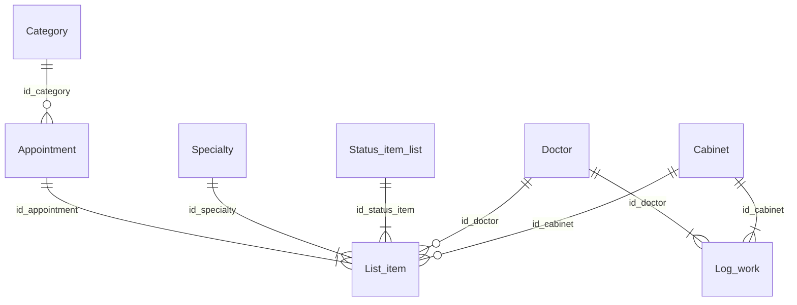
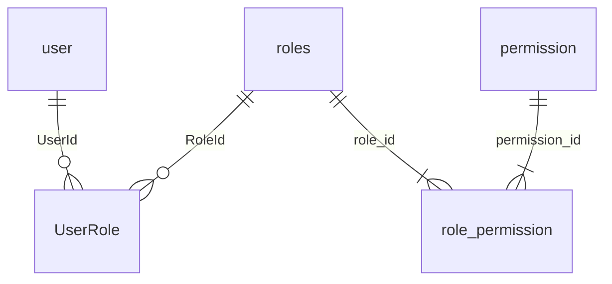

# ER-модель: реально используемые данные WebApplication

Спецификация для построения ER-диаграммы в PowerDesigner. Включены только сущности и атрибуты, которые приложение **читает** в runtime (LINQ / Identity / прямые запросы). Полная физическая схема внешней очереди: [electronic-queue-prof-schema.md](electronic-queue-prof-schema.md).

| | |
|---|---|
| **Сервер** | `localhost\SQLEXPRESS` |
| **Базы** | `ElectronicQueueProf` (read-only), `UserDb` (read/write) |
| **Дата снятия схемы** | 2026-05-20 |
| **Источники** | `sqlcmd` (PK/FK/nullable), код (`ElectronicQueueDbContext`, `AppDbContext`, сервисы) |

---

## Маппинг типов SQL Server → PowerDesigner

| SQL Server | PowerDesigner |
|----------|---------------|
| `int` | Integer |
| `varchar(n)` | Variable Characters(n) |
| `nvarchar(n)` | NVarChar(n) |
| `date` | Date |
| `time` | Time |
| `bit` | Boolean |
| `datetime2` | Timestamp |

---

## Матрица: таблица → подсистемы

### ElectronicQueueProf

| Таблица | Дашборд | Отчёты каталога | Прочее |
|---------|---------|-----------------|--------|
| `Appointment` | `QueueDashboardService` | arrived-and-completed, no-shows, waiting, appointment-duration, route-and-pauses, service-categories-comparison, service-delays; `CatalogAppointmentDataLoader` | — |
| `List_item` | `QueueDashboardService` | все отчёты выше + load-and-downtime | — |
| `Doctor` | `QueueDashboardService` | load-and-downtime, appointment-duration, service-delays; фильтры `ReportGenerationService` | — |
| `Cabinet` | `QueueDashboardService` (через Include) | load-and-downtime, appointment-duration, service-delays; фильтры `ReportGenerationService` | — |
| `Category` | Include в дашборде | arrived-and-completed, no-shows, service-categories-comparison; фильтры `ReportGenerationService` | — |
| `Specialty` | `QueueDashboardService` (норматив, подпись) | load-and-downtime, appointment-duration, service-delays | — |
| `Status_item_list` | неявки «сегодня» по имени статуса | load-and-downtime (join, без фильтра по имени в no-shows) | — |
| `Log_work` | — | load-and-downtime | — |

**Не входит в ER (есть в БД/EF, нет чтения в коде):** `Setting_queue` — FK `Category.id_setting` существует физически, приложение колонку не читает.

### UserDb

| Таблица | Подсистемы |
|---------|------------|
| `user` | `AuthService`, `UserService`, `UserProfileService`, `PasswordGeneratorService`, Identity (`UserManager`) |
| `roles` | Seed, `RolePermissionService`, `UserManager.GetRolesAsync` |
| `permission` | `RolePermissionService`, `UserPermissionContext`, `ReportsController` |
| `role_permission` | `RolePermissionService` |
| `AspNetUserRoles` (логическая сущность **UserRole**) | `UserService` (назначение роли), `AuthService`, `UserPermissionContext` — не claims-таблица |

**Исключены из ER:** `AspNetUserClaims`, `AspNetRoleClaims`, `AspNetUserLogins`, `AspNetUserTokens`.

---

## Диаграммы

### ElectronicQueueProf (используемое подмножество)

### UserDb

---

## Сущности и атрибуты

Обозначения в колонке **NULL**: `N` — NOT NULL, `Y` — nullable. **PK** — первичный ключ. **FK→** — внешний ключ (связь описана в разделе «Связи»).

### ElectronicQueueProf

#### Appointment (`dbo.Appointment`)

| Атрибут | PK | FK→ | Тип SQL | PowerDesigner | NULL | Использование в коде |
|---------|----|-----|---------|---------------|------|----------------------|
| id_appointment | PK | | int | Integer | N | PK; группировки, фильтры |
| id_category | | Category.id_category | int | Integer | Y | Фильтр отчётов; `Category.Priority` на дашборде |
| date_arrival | | | date | Date | N | Период отчётов, дашборд «сегодня» |
| time_arrival | | | time | Time | N | Ожидание, дашборд, route-and-pauses |
| priority | | | int | Integer | N | Сортировка очереди на дашборде |
| info | | | varchar(512) | Variable Characters(512) | Y | Пациент в UI/отчётах |
| time_complete | | | time | Time | Y | Завершённость талона, route-and-pauses |

#### Category (`dbo.Category`)

| Атрибут | PK | FK→ | Тип SQL | PowerDesigner | NULL | Использование в коде |
|---------|----|-----|---------|---------------|------|----------------------|
| id_category | PK | | int | Integer | N | PK |
| name | | | varchar(64) | Variable Characters(64) | N | Подписи отчётов, фильтры |
| priority | | | int | Integer | N | Сортировка категорий; приоритет на дашборде |

*Физический FK `id_setting` → `Setting_queue` не читается приложением — в ER не моделируется.*

#### List_item (`dbo.List_item`)

| Атрибут | PK | FK→ | Тип SQL | PowerDesigner | NULL | Использование в коде |
|---------|----|-----|---------|---------------|------|----------------------|
| id_list_item | PK | | int | Integer | N | PK; порядок этапов маршрута |
| id_appointment | | Appointment.id_appointment | int | Integer | N | Связь с талоном |
| id_specialty | | Specialty.id_specialty | int | Integer | N | Срезы, нормативы |
| id_status_item | | Status_item_list.id_status_item | int | Integer | N | Неявки на дашборде; join в load-and-downtime |
| id_cabinet | | Cabinet.id_cabinet | int | Integer | Y | Подпись кабинета, service-delays |
| id_doctor | | Doctor.id_doctor | int | Integer | Y | Загрузка врачей; проверка `IdDoctor > 0` |
| time_call | | | time | Time | Y | Ожидание, завершённость, маршруты |
| time_start_servicing | | | time | Time | Y | Длительность, load-and-downtime, дашборд |
| time_end_servicing | | | time | Time | Y | Завершённость этапа/талона |

#### Doctor (`dbo.Doctor`)

| Атрибут | PK | FK→ | Тип SQL | PowerDesigner | NULL | Использование в коде |
|---------|----|-----|---------|---------------|------|----------------------|
| id_doctor | PK | | int | Integer | N | PK, фильтры |
| full_name | | | varchar(150) | Variable Characters(150) | N | UI, отчёты |

#### Cabinet (`dbo.Cabinet`)

| Атрибут | PK | FK→ | Тип SQL | PowerDesigner | NULL | Использование в коде |
|---------|----|-----|---------|---------------|------|----------------------|
| id_cabinet | PK | | int | Integer | N | PK, фильтры |
| cabinet_number | | | varchar(7) | Variable Characters(7) | Y | Подписи «Каб. …» |

*Физические FK `id_board`, `id_location` не используются — в ER не моделируются.*

#### Specialty (`dbo.Specialty`)

| Атрибут | PK | FK→ | Тип SQL | PowerDesigner | NULL | Использование в коде |
|---------|----|-----|---------|---------------|------|----------------------|
| id_specialty | PK | | int | Integer | N | PK |
| definition | | | varchar(128) | Variable Characters(128) | N | Подпись специальности |
| time_servicing | | | int | Integer | N | Норматив (мин); service-delays, дашборд |

#### Status_item_list (`dbo.Status_item_list`)

| Атрибут | PK | FK→ | Тип SQL | PowerDesigner | NULL | Использование в коде |
|---------|----|-----|---------|---------------|------|----------------------|
| id_status_item | PK | | int | Integer | N | PK |
| name | | | varchar(64) | Variable Characters(64) | Y | `QueueDashboardStatusMapper` — неявки по имени |

#### Log_work (`dbo.Log_work`)

| Атрибут | PK | FK→ | Тип SQL | PowerDesigner | NULL | Использование в коде |
|---------|----|-----|---------|---------------|------|----------------------|
| id_log_work | PK | | int | Integer | N | PK |
| id_cabinet | | Cabinet.id_cabinet | int | Integer | N | Окна работы кабинета |
| id_doctor | | Doctor.id_doctor | int | Integer | N | Окна работы врача |
| date_work | | | date | Date | N | Период отчёта load-and-downtime |
| time_begin | | | time | Time | N | Начало смены |
| time_end | | | time | Time | Y | Конец смены |

---

### UserDb

#### user (`dbo.user`)

| Атрибут | PK | FK→ | Тип SQL | PowerDesigner | NULL | Использование в коде |
|---------|----|-----|---------|---------------|------|----------------------|
| Id | PK | | nvarchar(450) | NVarChar(450) | N | PK Identity |
| UserName | | | nvarchar(256) | NVarChar(256) | Y | Логин (= Email) |
| Email | | | nvarchar(256) | NVarChar(256) | Y | Регистрация, профиль, вход |
| PasswordHash | | | nvarchar(max) | NVarChar | Y | `CheckPasswordAsync` |
| EmailConfirmed | | | bit | Boolean | N | `IsEmailConfirmedAsync` при входе |
| first_name | | | nvarchar(100) | NVarChar(100) | N | Профиль, список пользователей |
| last_name | | | nvarchar(100) | NVarChar(100) | N | Профиль, список пользователей |
| patronymic | | | nvarchar(100) | NVarChar(100) | Y | Профиль |
| refresh_token | | | nvarchar(512) | NVarChar(512) | Y | Refresh / logout |
| refresh_token_expires_at | | | datetime2 | Timestamp | Y | Срок refresh |
| refresh_session_extended | | | bit | Boolean | N | «Запомнить меня» |

*Колонки Identity (`SecurityStamp`, `ConcurrencyStamp`, `NormalizedEmail` и др.) при `UpdateAsync` меняются фреймворком, но приложением не читаются — в ER по критерию used_only не включены.*

#### roles (`dbo.roles`)

| Атрибут | PK | FK→ | Тип SQL | PowerDesigner | NULL | Использование в коде |
|---------|----|-----|---------|---------------|------|----------------------|
| Id | PK | | nvarchar(450) | NVarChar(450) | N | PK |
| Name | | | nvarchar(256) | NVarChar(256) | Y | Роль в JWT, матрица прав |

#### permission (`dbo.permission`)

| Атрибут | PK | FK→ | Тип SQL | PowerDesigner | NULL | Использование в коде |
|---------|----|-----|---------|---------------|------|----------------------|
| permission_id | PK | | int | Integer | N | PK (IDENTITY) |
| permission_name | | | nvarchar(256) | NVarChar(256) | N | Уникальный ключ права (отчёт/дашборд) |

#### role_permission (`dbo.role_permission`)

| Атрибут | PK | FK→ | Тип SQL | PowerDesigner | NULL | Использование в коде |
|---------|----|-----|---------|---------------|------|----------------------|
| role_id | PK | roles.Id | nvarchar(450) | NVarChar(450) | N | Составной PK |
| permission_id | PK | permission.permission_id | int | Integer | N | Составной PK |

#### UserRole — логическая сущность (физ. `dbo.AspNetUserRoles`)

Связующая таблица M:N **user** ↔ **roles**. Не является claims-таблицей.

| Атрибут | PK | FK→ | Тип SQL | PowerDesigner | NULL | Использование в коде |
|---------|----|-----|---------|---------------|------|----------------------|
| UserId | PK | user.Id | nvarchar(450) | NVarChar(450) | N | `AddToRoleAsync`, `GetRolesAsync` |
| RoleId | PK | roles.Id | nvarchar(450) | NVarChar(450) | N | то же |

---

## Связи

Формат кардинальности: со стороны **родителя** — **дочерний**. Обязательность FK: по `IS_NULLABLE` дочерней колонки на `localhost\SQLEXPRESS`, 2026-05-20.

### ElectronicQueueProf

| Родитель | Дочерний | FK (дочерний) | Кардинальность | FK обязателен | Родитель обязателен для дочернего | Примечание |
|----------|----------|---------------|----------------|---------------|-----------------------------------|------------|
| Category | Appointment | id_category | 1 : 0..* | N (nullable) | N | Талон может быть без категории в БД |
| Appointment | List_item | id_appointment | 1 : 1..* | Y | Y | Этапы маршрута; в отчётах встречаются талоны без этапов (неявка) |
| Specialty | List_item | id_specialty | 1 : 1..* | Y | Y | |
| Status_item_list | List_item | id_status_item | 1 : 1..* | Y | Y | |
| Doctor | List_item | id_doctor | 1 : 0..* | N | N | В коде: `IdDoctor > 0` как признак назначенного врача |
| Cabinet | List_item | id_cabinet | 1 : 0..* | N | N | |
| Doctor | Log_work | id_doctor | 1 : 1..* | Y | Y | |
| Cabinet | Log_work | id_cabinet | 1 : 1..* | Y | Y | |

**Delete rule (EF, read-only контекст):** все перечисленные FK — `ON DELETE RESTRICT` / NO ACTION в БД.

### UserDb

| Родитель | Дочерний | FK (дочерний) | Кардинальность | FK обязателен | Родитель обязателен | Примечание |
|----------|----------|---------------|----------------|---------------|---------------------|------------|
| user | UserRole | UserId | 1 : 0..* | Y | N | Пользователь может быть без роли до назначения |
| roles | UserRole | RoleId | 1 : 0..* | Y | N | |
| roles | role_permission | role_id | 1 : 0..* | Y | N | CASCADE при удалении роли (EF) |
| permission | role_permission | permission_id | 1 : 0..* | Y | N | CASCADE при удалении permission (EF) |

**Цепочка авторизации:** user → UserRole → roles → role_permission → permission (имя права сопоставляется с id отчёта/блока дашборда).

---

## Расхождения EF ↔ физическая БД

| Область | В БД | В EF / коде | Рекомендация для ER |
|---------|------|-------------|---------------------|
| `List_item.id_cabinet`, `id_doctor` | nullable | `int` non-nullable в `EqListItem` | Моделировать как **optional** FK (0..*) |
| `Appointment.id_category` | nullable | `int` non-nullable в `EqAppointment` | optional FK к Category |
| `Appointment.number` | NOT NULL | замаплено | **Не в ER** — не читается в LINQ |
| `Appointment.time_start_pause`, `id_client` | есть | замаплено | **Не в ER** — не читаются |
| `List_item.service_time` | nullable | замаплено | **Не в ER** — не читается |
| `Category.id_setting` | NOT NULL, FK | замаплено + навигация | **Не в ER** — нет запросов к `SettingQueues` |
| `Setting_queue` | таблица + FK на Specialty | DbSet есть | Вне scope used_only |
| `Cabinet` | `id_board`, `id_location` NOT NULL/YES | не замаплено | Вне scope; только `cabinet_number` в ER |
| `Log_work.last_refresh` | nullable | замаплено | **Не в ER** — не читается |
| `user` | полный набор Identity | `IdentityUser` + 4 кастомных поля + refresh | В ER — только used_only (см. таблицу) |

---

## Приложение: физические FK вне ER-модели

Существуют в `ElectronicQueueProf`, но родительская сущность **не входит** в используемое подмножество (не моделировать связь в PowerDesigner для мониторинга):

| FK | Дочерняя таблица.колонка | Родитель (вне ER) |
|----|--------------------------|-------------------|
| FK_APPOINTM_POSSESS_STATUS_A | Appointment.id_status_app | Status_Appointment |
| FK_APPOINTM_LAST_ID_L_LOCATION | Appointment.last_id_location | Location |
| FK_CABINET_DISPLAY_BOARD | Cabinet.id_board | Board |
| FK_CABINET_LOCATE_LOCATION | Cabinet.id_location | Location |
| FK_CATEGORY_HAVE_CONF_SETTING_ | Category.id_setting | Setting_queue |
| FK_SETTING__STARTING_SPECIALT | Setting_queue.start_id_specialty | Specialty |
| FK_SETTING__ENDING_SPECIALT | Setting_queue.end_id_specialty | Specialty |

Связи `Previous_specialty`, `Refer`, `Show`, `SEC_*` и др. — UI/безопасность исходной системы очереди, приложением мониторинга не используются.

---

## См. также

- [electronic-queue-prof-schema.md](electronic-queue-prof-schema.md) — полная схема dbo
- [report-db-field-mapping.md](report-db-field-mapping.md) — поля по отчётам
- [scripts/export-electronic-queue-schema.sql](scripts/export-electronic-queue-schema.sql) — повторное снятие схемы
