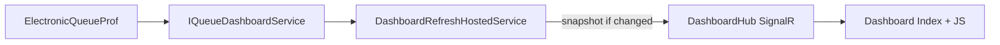

# Live-мониторинг Dashboard: минимальные требования

Документ описывает **минимум для live-обновления** страницы «Мониторинг очереди» (`/dashboard`): транспорт, серверный контур, контракт данных и границы.  
**Интерфейс** (колонки, бейджи, карточки) — в [queue-monitoring-page-ui-requirements.md](queue-monitoring-page-ui-requirements.md).  
**Схема БД** — [electronic-queue-prof-schema.md](electronic-queue-prof-schema.md).

---

## 1. Область

### В scope

| Элемент | Описание |
|---------|----------|
| Страница | `/dashboard` — [DashboardController.cs](../Controllers/DashboardController.cs) |
| Данные | Один snapshot [DashboardViewModel](../Models/DashboardViewModel.cs) — **без новых полей** относительно текущего mock/live |
| Источник | [IQueueDashboardService](../Services/IQueueDashboardService.cs) → live [QueueDashboardService](../Services/QueueDashboardService.cs) или mock [MockQueueDashboardService](../Services/MockQueueDashboardService.cs) через [ResilientQueueDashboardService](../Services/ResilientQueueDashboardService.cs) |
| Доставка | ASP.NET Core **SignalR** (серверный сбор snapshot → broadcast) |
| Права | Существующие `dashboard.*` — [RolePermissionService](../Services/RolePermissionService.cs), [DashboardUiVisibility](../Models/DashboardViewModel.cs) |

### Состав snapshot (контракт данных)

**Метрики (6 карточек):**

| Поле | Назначение |
|------|------------|
| `WaitingCount` | Ожидают приёма |
| `InServiceCount` | На приёме |
| `AcceptedTodayCount` | Обслужено за сегодня |
| `NoShowTodayCount` | Не явились за сегодня |
| `AvgWaitMinutes`, `MaxWaitMinutes` | Среднее и макс. ожидание (мин) за сегодня |
| `AvgServiceMinutes`, `MaxServiceMinutes` | Средняя и макс. длительность приёма (мин) за сегодня |

**Таблица «Текущая очередь»** — `ActiveQueue`: список [DashboardQueueRowViewModel](../Models/DashboardViewModel.cs) (`IdAppointment`, `Patient`, приоритеты для сортировки, `WaitingMinutes`, `CurrentCabinet`, `CurrentDoctor`, `Specialty`, `ArrivalTime`, `StatusLabel`, `StatusCode`).

**Блок «Состояние врачей»** — `DoctorLoadCards`: список [DoctorLoadCardViewModel](../Models/DashboardViewModel.cs) (`IdDoctor`, `FullName`, `Specialty`, `Cabinet`, `IsInService`, `CurrentServiceMinutes`, `NormServiceMinutes`, `QueueLength`).

**Видимость блоков** — `Ui` (`DashboardUiVisibility`): как при первом SSR; набор прав `dashboard.waiting`, `dashboard.in-service`, `dashboard.accepted-today`, `dashboard.noshow-today`, `dashboard.avg-wait`, `dashboard.avg-service`, `dashboard.queue-table`, `dashboard.chart-cabinets-load`. **Новые права не вводить.**

### Вне scope

- Отчёты, новые метрики, новые колонки, графики «загруженность за сегодня».
- Запись в `ElectronicQueueProf` (режим read-only сохраняется).
- SqlDependency, CDC, push из внешней системы очереди.
- Клиентский polling (`setInterval` + REST) как **целевая** архитектура — допустим только как временный обход; в продукте — SignalR.

---

## 2. Архитектура

### Обязательные правила

1. **Один** периодический сбор snapshot на инстанс приложения (`IHostedService` / `BackgroundService`), а не опрос БД с каждого браузера.
2. Рассылка подключённым **авторизованным** клиентам через SignalR (`AddSignalR`, `MapHub`).
3. Сбор данных — только через `IQueueDashboardService.GetDashboardAsync()` (live или mock — как при первом GET страницы).
4. **Желательно (не блокер MVP):** не отправлять push, если snapshot семантически не изменился (сравнение или хеш).

### Анти-паттерн

N открытых вкладок → N независимых `setInterval` → N запросов к `ElectronicQueueProf` на каждый тик.

---

## 3. Контракт SignalR

| Параметр | Требование |
|----------|------------|
| Hub | Например `DashboardHub`, маршрут `/hubs/dashboard` (имя уточняется при реализации) |
| Событие клиенту | Например `DashboardUpdated` |
| Тело | JSON, поля 1:1 с `DashboardViewModel` или отдельный `DashboardSnapshotDto` **без дополнительных полей** |
| `Ui` в push | **Рекомендация:** первый рендер — Razor с учётом прав; в push передавать только блоки данных (метрики, `ActiveQueue`, `DoctorLoadCards`). Скрытые по правам секции на клиенте не создавать и не заполнять |
| Авторизация | `[Authorize]` на Hub; JWT из cookie — как в [Program.cs](../Program.cs) (`JwtBearerEvents.OnMessageReceived`) |

---

## 4. Источник данных (live)

Расчёт — [QueueDashboardService.cs](../Services/QueueDashboardService.cs). Таблицы — раздел «Дашборд» в [electronic-queue-prof-schema.md](electronic-queue-prof-schema.md).

| Блок UI | Суть расчёта |
|---------|--------------|
| Ожидают | `List_item` + `Appointment`: нет вызова, нет конца обслуживания, талон не завершён |
| На приёме | Есть `time_call`, нет `time_end_servicing` |
| Обслужено за сегодня | Завершённые этапы за сегодня (`date_arrival`, все ключевые времена этапа) |
| Не явились за сегодня | `date_arrival = сегодня`, статус этапа из `Status_item_list` — [QueueDashboardStatusMapper](../Services/QueueDashboardStatusMapper.cs) (`IsNoShowStatusName`) |
| Средние/макс. ожидание и приём | По завершённым ожиданиям/приёмам за сегодня |
| Текущая очередь | `Appointment` с `time_complete == null`; текущий этап — первый незавершённый по возрастанию `id_list_item`; сортировка: приоритет талона → категории → время ожидания |
| Состояние врачей | Справочник `Doctor`; активный приём; норма — `Specialty.time_servicing`; очередь врача — этапы «ожидает»/«вызван» с тем же `id_doctor` |

**«Сегодня»** — календарная дата **UTC** сервера (`DateOnly.FromDateTime(DateTime.UtcNow.Date)`), как в текущем коде.  
**Порядок этапов маршрута** — по возрастанию `id_list_item` (не `item_order`).

Статусы в UI: `QueueDashboardStatusMapper.ResolveForCurrentStep` → `(StatusLabel, StatusCode)`; коды: `waiting`, `called`, `in-service`, `done`, `no-show`.

---

## 5. Клиент (минимум)

- Подключение к Hub на [Views/Dashboard/Index.cshtml](../Views/Dashboard/Index.cshtml).
- По событию `DashboardUpdated`: обновить значения в `stats-row`, пересобрать `tbody` таблиц очереди и врачей (разметка и классы — как в [_DashboardQueueTable.cshtml](../Views/Dashboard/_DashboardQueueTable.cshtml), [_DashboardDoctorLoad.cshtml](../Views/Dashboard/_DashboardDoctorLoad.cshtml)).
- После перерисовки **сохранить** состояние фильтров [dashboard-queue.js](../wwwroot/js/dashboard-queue.js) и [dashboard-doctor-load.js](../wwwroot/js/dashboard-doctor-load.js) (повторно вызвать `apply` / `filter`).
- Reconnect SignalR; индикатор потери связи; при mock — по возможности пометка «демо-данные».
- **MVP:** полный `location.reload()` не требуется.

Скрипт live-контура (при реализации): `wwwroot/js/dashboard-live.js` (или аналог).

---

## 6. Конфигурация и нагрузка

- Интервал фонового обновления — настраиваемое поле в [MonitoringOptions](../Models/MonitoringOptions.cs) (например `DashboardRefreshSeconds`). Конкретное значение **выбирается при внедрении** с учётом нагрузки на `ElectronicQueueProf` и числа одновременных мониторов; в требованиях не фиксируется.
- Один фоновый цикл на инстанс: **M пользователей ≠ M опросов БД** за тик.
- WebSockets: прокси/IIS должны пропускать путь Hub.

---

## 7. Критерии готовности

- [ ] `/dashboard` обновляет метрики и таблицы без F5.
- [ ] Snapshot при live БД совпадает с однократным `GetDashboardAsync()` в том же моменте (допуск — расхождение минут ожидания из-за `UtcNow` между вызовами).
- [ ] При недоступной `ElectronicQueue` — mock, страница и Hub не падают.
- [ ] Блоки без права `dashboard.*` не отображаются и не обновляются.
- [ ] Фильтры поиска/специальности/статуса/ожидания в таблице очереди работают после push.

---

## 8. Связанные документы и код

| Документ / файл | Назначение |
|-----------------|------------|
| [queue-monitoring-page-ui-requirements.md](queue-monitoring-page-ui-requirements.md) | UI, колонки, бейджи, пустые состояния |
| [electronic-queue-prof-schema.md](electronic-queue-prof-schema.md) | Таблицы и поля БД |
| [reusable-ui-components-requirements.md](reusable-ui-components-requirements.md) | Общие компоненты (SearchBox и т.д.) |
| [DashboardController.cs](../Controllers/DashboardController.cs) | SSR первого захода |
| [QueueDashboardService.cs](../Services/QueueDashboardService.cs) | Live-расчёт |
| [MockQueueDashboardService.cs](../Services/MockQueueDashboardService.cs) | Демо-snapshot |
| [ResilientQueueDashboardService.cs](../Services/ResilientQueueDashboardService.cs) | Выбор live/mock |
| [Program.cs](../Program.cs) | Auth, DI (SignalR — при реализации) |

---

Если поведение в коде и этот файл разошлись — **приоритет у кода**; обнови этот файл под новую договорённость.
